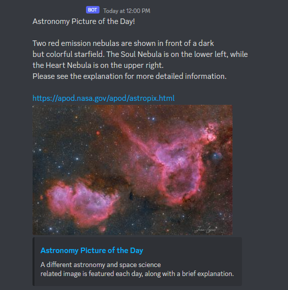

# astropix

Quick 25 minute coding project to grab NASA's picture of the day and send it to my Discord server.

This project uses aiohttp and bs4 to grab the photo from the webpage, format it into a message, then send it. It doesn't run on a fancy clock or anything to regulate the timing, but rather using crontab. The program exits as soon as it sends a message and is scheduled to run every day at noon.

Here is the crontab entry I personally use:
`0 12 * * * python3 astropix.py`

In order to make the bot work, you need to have an app through the Discord dev portal, and then you need a config.py file that holds your API token, guild ID, and channel ID.

## Example Screenshot

